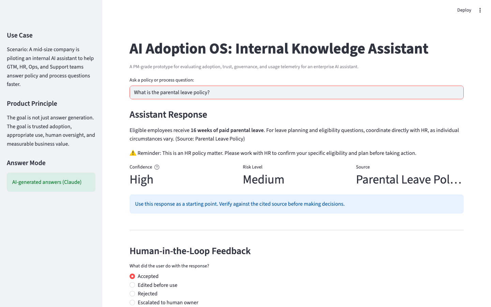
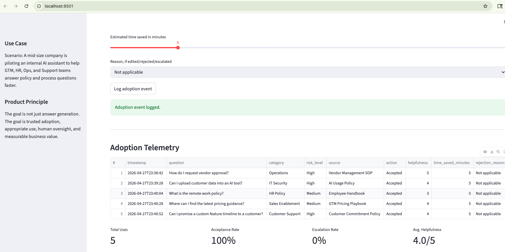

# AI Adoption OS: From Pilot to Production

A product-led framework and working prototype for turning enterprise AI pilots into trusted, measurable production systems.

## What This Demonstrates

- Product strategy for enterprise AI
- Human-centered workflow design
- Governance and risk controls
- Adoption telemetry and KPIs
- Pilot-to-production execution

## Screenshots

### Prototype Interface


### Telemetry Dashboard


## Included Assets

### Product Assets
- Working product demo
- Knowledge base
- Scorecard

### Operating Assets
- Governance model
- Rollout plan
- RACI
- Risk register

### Measurement Assets
- Telemetry logging
- Metrics framework
- Feedback taxonomy

## Why This Matters

Many AI initiatives fail not because the model is weak, but because:

- workflow fit is poor  
- users do not trust outputs  
- ownership is unclear  
- escalation paths are missing  
- adoption is not measured  
- governance is weak

## Use Case

A mid-size enterprise deploys an internal AI assistant for GTM, HR, Operations, and Support teams while maintaining trust, compliance, and escalation controls.

The core product question:

> If employees use an AI assistant for internal knowledge, how do we ensure they trust it appropriately, use it in the right moments, escalate high-risk cases, and generate measurable business value?

## Key Product Insight

AI value depends on whether people use the system, trust outputs appropriately, and know when human review is required.

## Prototype Features

The working product demo allows a user to:

1. Ask a policy or process question
2. Receive an answer from an approved knowledge base
3. See a cited source
4. See a confidence and risk label
5. Accept, edit, reject, or escalate the response
6. Log helpfulness, time saved, and rejection reason
7. View adoption telemetry

## Metrics

The project focuses on product and adoption metrics, not only model metrics.

### Executive KPIs
- ROI per active user
- Cost per resolved query

### Adoption Metrics
- Weekly active users
- Repeat usage rate
- Percentage of eligible tasks using AI

### Trust Metrics
- Acceptance rate
- Rejection rate
- Escalation rate

### Governance Metrics
- High-risk queries flagged
- Source coverage gaps

## Product Flow

```text
User Question → Retrieval Logic → Approved Source → Response → Feedback Capture → Telemetry → Insights
```

## How to Run the Prototype

```bash
python3 -m venv .venv
source .venv/bin/activate
pip install -r prototype/requirements.txt
streamlit run prototype/app.py
```

## Artifacts

- `scorecard/ai-adoption-readiness-scorecard.xlsx`  
  AI Adoption Readiness Scorecard used to evaluate whether enterprise AI use cases should scale, pause, or redesign.

## Closing Perspective

AI advantage rarely comes from the model alone. It comes from workflows people trust, use, and sustain.

