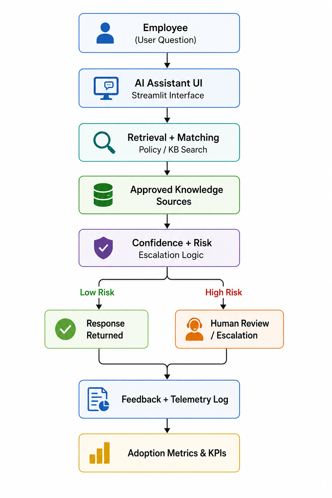

# AI Adoption OS: From Pilot to Production

AI Adoption OS is a product-led framework and working prototype focused on the operational layer required to move enterprise AI from experimentation to trusted production usage.

The project explores how workflow design, human oversight, governance controls, escalation logic, and adoption telemetry influence whether AI systems become trusted operational capabilities.

## Why This Exists

Most AI pilots fail to become trusted, repeatable operating capabilities because organizations focus on the model before solving workflow fit, human oversight, governance, and adoption measurement.

## Why This Matters

Many AI initiatives fail not because the model is weak, but because:

- workflow fit is poor  
- users do not trust outputs  
- ownership is unclear  
- escalation paths are missing  
- adoption is not measured  
- governance is weak

## Problem

Organizations often struggle to move AI from experimentation to production because ownership, decision rights, escalation paths, and success metrics are unclear.

## Product Approach

The prototype includes a Streamlit interface, TF-IDF retrieval over an approved knowledge base, Claude-generated grounded answers with source citations, persistent SQLite telemetry, feedback capture, and escalation workflows designed to simulate enterprise AI operating patterns and operational oversight.

When no API key is configured, the prototype runs in a retrieval-only fallback mode that displays the best-matching approved knowledge base entry directly, so the demo remains fully runnable.

## Design Principles

- Human oversight over full automation
- Governance integrated into workflows
- Adoption measured behaviorally, not only technically
- Escalation pathways for high-risk decisions
- Operational trust as a core product requirement

## What This Demonstrates

- Enterprise AI product strategy
- Human-in-the-loop workflow design
- Governance and escalation modeling
- Adoption telemetry and operational KPIs
- Pilot-to-production systems thinking
- AI operating model design

## Screenshots

### Prototype Interface


### Telemetry Dashboard


*Sample telemetry from demo usage*

## Use Case

A mid-size enterprise deploys an internal AI assistant across GTM, HR, Operations, and Support workflows while maintaining trust, compliance, escalation handling, and operational oversight.

The core product question:

> If employees use an AI assistant for internal knowledge, how do we ensure they trust it appropriately, use it in the right moments, escalate high-risk cases, and generate measurable business value?

## Key Product Insight

AI value depends on whether people use the system, trust outputs appropriately, and know when human review is required.

## Prototype Features

The working product demo allows a user to:

1. Ask a policy or process question
2. Receive an answer from an approved knowledge base
3. See a cited source
4. See a confidence and risk label
5. Accept, edit, reject, or escalate the response
6. Log helpfulness, time saved, and rejection reason
7. View adoption telemetry

## Architecture

The prototype follows a simplified enterprise AI operating architecture designed to simulate how organizations operationalize AI-supported workflows with oversight and telemetry.

### System Architecture



This architecture emphasizes retrieval-based guidance, LLM answer generation grounded in approved sources, escalation handling, human oversight, persistent telemetry logging, and operational adoption measurement.

## Product Flow

```text
User Question → TF-IDF Retrieval (scored) → Top Approved Sources
             → Claude Generation (grounded, cited)  [or retrieval-only fallback]
             → Response with Confidence + Risk Labels
             → Feedback Capture → SQLite Telemetry → Insights
```

Key behaviors:

- **Confidence** is derived from retrieval similarity scores — separate from **Risk**, which is knowledge base metadata
- Questions below the confidence threshold are treated as source coverage gaps and routed to escalation
- Claude answers only from the approved sources provided, cites the source, and recommends escalation when sources do not cover the question
- All adoption events persist in SQLite across sessions, so telemetry reflects real cumulative usage

## Core Workflows

The project models enterprise AI workflows including policy Q&A, escalation handling, vendor approval support, human review for high-risk responses, and feedback capture for continuous operational improvement.

## Governance Model

The governance model clarifies human oversight, decision ownership, escalation rules, and accountability for AI-supported workflows. 

## Adoption Telemetry

The prototype tracks usage, feedback, unresolved questions, and escalation signals to show whether AI is being adopted safely and usefully.

## Evaluation Framework

Future iterations will evaluate answer relevance, source accuracy, escalation quality, user trust, and workflow completion.

## Metrics

The project focuses on product and adoption metrics, not only model metrics. The emphasis is on operational adoption, trust calibration, workflow integration, and measurable organizational usage.

### Executive KPIs

- ROI per active user
- Cost per resolved query

### Adoption Metrics

- Weekly active users
- Repeat usage rate
- Percentage of eligible tasks using AI

### Trust Metrics

- Acceptance rate
- Rejection rate
- Escalation rate

### Governance Metrics

- High-risk queries flagged
- Source coverage gaps

## Included Assets

### Product Assets

- Working product demo
- Knowledge base
- Scorecard

### Operating Assets

- Governance model
- Rollout plan
- RACI
- Risk register

### Measurement Assets

- Telemetry logging
- Metrics framework
- Feedback taxonomy

## Roadmap

The roadmap includes stronger retrieval, role-based access, evaluation tests, improved telemetry, workflow orchestration, and production-readiness controls.

## Production Considerations

Future production-oriented iterations would include:

- Role-based access controls
- Vector-based retrieval
- Audit logging
- Prompt injection mitigation
- Security and privacy controls
- Evaluation pipelines
- Workflow orchestration
- Cost and latency monitoring
- Human approval checkpoints

These considerations are critical for moving AI systems from experimentation into sustainable organizational infrastructure.

## What I Would Build Next

Next iterations would include vector-based retrieval, source attribution, role-based permissions, richer operational dashboards, evaluation pipelines, and more advanced workflow orchestration.

## How to Run the Prototype

```bash
python3 -m venv .venv
source .venv/bin/activate
pip install -r requirements.txt
streamlit run prototype/app.py
```

To enable AI-generated answers, copy `.env.example` to `.env` and add your Anthropic API key:

```bash
cp .env.example .env
# then edit .env and set ANTHROPIC_API_KEY
```

Without a key, the prototype runs in retrieval-only fallback mode.

## Artifacts

- `scorecard/ai-adoption-readiness-scorecard.xlsx`  
AI Adoption Readiness Scorecard used to evaluate whether enterprise AI use cases should scale, pause, or redesign.

## Closing Perspective

AI advantage rarely comes from the model alone. It comes from workflows people trust, use, and sustain.
